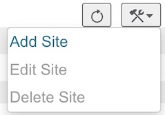
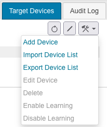

# Standalone ACI-Endpoint-Update-App


- [Installation Instructions](#instructions)
- [Configure the Standalone ACI Endpoint Update App](#configuration-steps)
  - [Prerequisites for Configuration](#prerequisites)
    - [Create APIC Users for the Standalone ACI Endpoint Update App](#create-apic-users)
    - [Configure the Management Center Domains and Subdomains](#configure-fmc-domains)
    - [Create management center Users for the Standalone ACI Endpoint Update App](#create-fmc-users)
  - [Configuration on the Standalone ACI Endpoint Update App](#configuration-on-the-app)
    - [Before you begin](#before-you-begin)
    - [Procedure](#procedure-of-config)
    - [Global and Device-Specific Options](#global-and-device-options)
    - [Disable Learning Reference](#disable-learning-reference)
- [Security Notes](#security-notes)

<a name="instructions"></a>
## Installation Instructions

* Prepare hosting VM, for example, Ubuntu 20.04 or 22.04. (Recommended CPU cores: 4 or more. Memory: 16GB or more.)

* Download install_aci_app_3.0.tgz

* Untar install_aci_app_3.0.tgz:
  
   ```tar xzvf install_aci_app_3.0.tgz```

   > You will find install_aci_app_3.0.sh under current directory.

* Run install_aci_app_3.0.sh to start the app container, usage is as follows:

   ```
  $ ./install_aci_app_3.0.sh
   
     Usage Example:
   
     ./install_aci_app_3.0.sh    # print this usage help
   
     ./install_aci_app_3.0.sh -s # Secure mode recommended for production. Configuration is accessible from localhost only, e.g. http://localhost:8000/configuration.json
   
     ./install_aci_app_3.0.sh -t # Test only, not recommended for production due to security reason. Configuration is accessible from any external host, e.g. http://<IP_of_this_host>:8000/configuration.json
   
     ./install_aci_app_3.0.sh -r # Run this to start an installed but exited ACI app container. Existing configuration would be kept.
   ```

For example, you may use ```./install_aci_app_3.0.sh -s``` to start the app in secure mode.

<a name="configuration-steps"></a>
## Configure the Standalone ACI Endpoint Update App 

The following task enables you to configure the Standalone ACI endpoint update app to communicate with APIC, Management Center, and ASA.

<a name="prerequisites"></a>
### Prerequisites for Configuration

The following topics discuss prerequisite tasks you must complete before configuring the Standalone ACI Endpoint Update App.

#### Create APIC Users for the Standalone ACI Endpoint Update App <a name="create-apic-users"></a>

You must have(or create) a user for the Standalone ACI Endpoint Update App to read the endpoint information from specified domains/tenants:

> To create or verify the user access to APIC, 
>
> ***Step 1***    Log in to the APIC if you haven't done so already.
>
> ***Step 2***    Click ***Admin > AAA > Users***.
>
> ***Step 3***    Click an existing user, or click ***Create Local User*** from the tool menu
>
> ***Step 4***    Verify the user has access to specific User Domain, and has at least Read Privilege.


#### Configure the Management Center Domains and Subdomains <a name="configure-fmc-domains"></a>

*This section applies to management center devices only.* ASA devices don't have domains.

Data in one APIC tenant is pushed and merged to one particular management center domain you configure. APIC does not modify or delete any other object in another management center domain. Note that objects defined in a domain are visible and usable in an management center's subdomains, and that can be a way to share an object across subdomains.

For more information about domains, see the chapter on domain management in the [Cisco Secure Firewall Management Center Configuration Guide](https://www.cisco.com/c/en/us/support/security/defense-center/products-installation-and-configuration-guides-list.html).

##### Create domains and subdomains

Before you continue, make sure you have created all users, domains, and subdomains on the management center. Subdomain users must be created in the correct domain (***System*** () ***> Users > Create User***. If necessary, click Add Domain to add the user to the desired domain.)

To create a domain on the management center:

Log in to the management center.

Click ***System*** () ***> Domains > Add Domain***.

Enter the required information.

Click ***Save***.

Click ***Save***.

##### Examples

When you add a target device in the Standalone ACI Endpoint Update App:

Enter a username only to push and merge the configuration to the default Global domain on the management center.

In the ***FMC Domain Name*** field, enter a domain in the format domain1 \domain2 to get dynamic data from the tenant and access the management center and update the objects of the subdomain named domain1 \domain2 of the Global domain..

In the ***FMC Username*** field, enter the username of a user with privileges to update objects in the management center.

#### Create management center Users for the Standalone ACI Endpoint Update App <a name="create-fmc-users"></a>

You must create one dedicated management center user for the Standalone ACI Endpoint Update App to update network object and dynamic object configuration:

The dedicated user is exclusively for the Standalone ACI Endpoint Update App to update the network object and dynamic object configuration

In addition, you must have a second administative user that can be shared between the Standalone ACI Endpoint Update App and other management center functions. (This can be an existing user or a new user.)

Each management center user must have the Administrator role. Each ASA user must have privilege level 15. It's necessary to have to users to avoid the Standalone ACI Endpoint Update App logging out the administrator unexpectedly.

The task that follows discusses how to create users on the management center only. To create ASA users, see the Cisco ASA Series General Operations ASDM Configuration Guide.

***Procedure***

---

***Step 1***    Log in to the Management Center if you haven't done so already.

***Step 2***    Click ***System > Users > Users***.

***Step 3***    Click ***Create User***.

***Step 4***    Under User Role Configuration, check ***Administrator***.

***Step 5***    (Optional.) Click ***Add Domain*** to give the user access to a particular domain.

Both management center users must be administrators in the same domains.

***Step 6***    Enter the other information required to configure the user; consult the online help for assistance.

---

### Configuration on the Standalone ACI Endpoint Update App <a name="configuration-on-the-app"></a>

#### Before you begin <a name="before-you-begin"></a>

Before you configure and use the Standalone ACI Endpoint Update App, complete all the following tasks:

Configure the APIC application at minimum with:

A tenant for the Management Center or ASA

In the tenant configuration, an application profile and an endpoint group (EPG)

For more information about configuring APIC, see the chapter on Basic User Tenant Configuration in the [Cisco APIC Basic Configuration Guide](https://www.cisco.com/c/en/us/support/cloud-systems-management/application-policy-infrastructure-controller-apic/tsd-products-support-series-home.html).

Create one dedicated user with the Administrator role.

For more information, see Create Users for the Standalone ACI Endpoint Update App.

(Optional.) Create domains on the Management Center as discussed in Configure the Management Center Domains and Subdomains.

#### Procedure <a name="procedure-of-config"></a>

---

***Step 1***    Launch a local browser to configure the app via the following URL:   

   ```http://localhost:8000/configuration.json```
  
  You would see the main page, All Sites page.

***Step 2***    Configure APIC Sites

* Click  > ***Add Site***.
  
  
  The following figure shows an example.

  
  

* Enter or edit the following information.

| ***Item***        | ***Description***           |
| -------------     |-------------|
| ***Site Name***      |Enter the APIC site name you want to use. <br>It needs to be a unique alphanumeric string to create a network group object on the management center or ASA. In a multi-tenant environment, different network group objects prevent the configuration sent by APIC from being confused with any other configuration.<br>Each site name needs to be a unique name from other existing configured ones, including the site names being used on the on-prem app.|
| ***IP***      |Enter the APIC server's IP address or fully-qualified host name. If APIC is behind a NAT device, separate the IP address from the port with a colon character; for example, 192.2.0.9:5001. Or enter APIC cluster names; for example, "apic1.cisco.com, apic2.cisco.com, apic3.cisco.com"|
| ***Username*** |Enter the username of the APIC that is with read privilege.      |
| ***Password*** |Enter the user's password. |
| ***Confirm Password***|Re-enter the user's password.| 
| ***Certificate***|Enter the certificate being used to access this APIC site. Default is empty. |


* After you’ve configured the site, click ***Submit***.


  The following figure shows an example.

  


***Step 3***    Configure Target Devices on Individual APIC Sites


* Click the site name to enter individual site configuration page


* Click  > ***Add Device***.

  The following figure shows an example.

   


* For Type, click either ***Secure Firewall Management Center*** or ***Secure Firewall ASA***.

Enter or edit the following information.


| ***Item***        | ***Description***           |
| -------------     |-------------|
| ***Tenant Name***      |Click the name of a tenant to which to add the device. (To select multiple tenants, hold down the Control key while clicking.) |
| ***IP***      |Enter the Management Center's or ASA's IP address or fully-qualified host name. If your Management Center or ASA is behind a NAT device, separate the IP address from the port with a colon character; for example, 192.2.0.9:5001.      |
| ***Username*** |Enter the user name of a Management Center or ASA user that is an Administrator in the domain (Management Center) or user context (ASA).      |
| ***Password*** |Enter the user's password. |
| ***Confirm Password***|Re-enter the user's password.|
| ***Domain***|(Management Center only.)<br> Enter the alphanumeric username used by the app to sign in to the Management Center. The username must be different than the username you use to sign in to the Management Center. Otherwise, if they're the same, your sessions might get disconnected.<br> Enter the domain and subdomain name, if any, to which to push data. Domain names can consist of alphanumeric characters or the \ and / characters only. For more information, see Configure the Management Center Domains and Subdomains.|
| ***Network Groups***|(Management Center only.) Check the box to deploy the network object configuration to the Management Center at the interval you select.<br>(Management Center only.) Uncheck the box if you don't want to push dynamic EPG data as network objects. Dynamic objects will be pushed to the configured Management Center if the Management Center version is 7.0 and later.|
| ***Automatic Deploy***|Management Center Check the box to start a Management Center policy deployment after the app completes a periodic endpoint update. Consider disabling this option during periods of desired manual control of Management Center configuration, such as during a maintenance window for Management Center policy changes.|


* After you’ve configured all your Management Centers or ASAs, click ***Submit***.

---
#### Global and Device-Specific Options <a name="global-and-device-options"></a>

* Test connectivity of APIC sites or target devices

You can test the connectivity to your configured APIC or target devices by clicking ; sites or devices with connection issues have an orange background in the Status column.

* Edit Update interval for each individual site

The interval, in seconds, to update the Management Center or ASA. Default is 60. The minimum interval is 10 seconds because updating too frequently might negatively impact system performance with a large number of the Management Centers or ASA.

You can edit it by clicking .


#### Disable Learning Reference <a name="disable-learning-reference"></a>
You can optionally clean up the APIC configuration pushed to the Management Center or ASA in the event any of the following occur:

You remove the APIC application entirely.

You move the APIC configuration to another Management Center or ASA.

The ACI endpoint update app cleans up the Management Center object group configuration only for the site that is displayed in the app. No other configuration is removed either; for examle, if Domain1 is defined for Site 1 and Domain2 is defined for Site 2, if you clean the configuration of Site 2, Domain 1 is not affected.

> Domains are supported on the Management Center only.

When disabling learning, check Erase all objects to erase the pushed object information on configured devices.To avoid configuration conflicts, we prevent pushing a new configuration to the Management Center or ASA at the same time as cleaning up an existing configuration.

If the object group you clean up is used in any access control rule on the Management Center or ASA, the following happens:

The Management Center network object or ASA network object group is not deleted.

The IP address is replaced by 127.0.0.1.


## Security Notes <a name="security-notes"></a>

* You should run the app in secure mode as you can to reduce security risk.

* Use strong username/password to login to the hosting VM.

* Hardening the hosting VM, including applying latest security patches, closing unused service ports etc.


